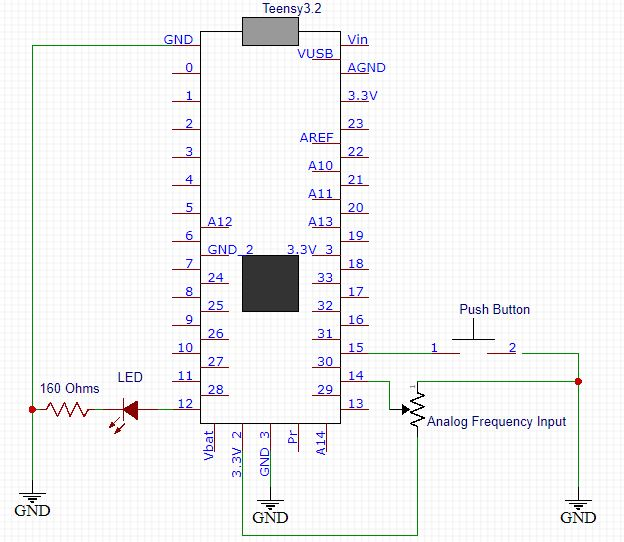
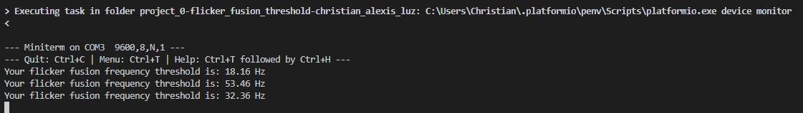

# Embedded Systems - Project 0 - Flicker Fusion Threshold
By Christian Alexis Luz
## ABSTRACT
The device was found to be able to print a frequency value closely matching with the frequency of flicker as measured on an oscilloscope. The use of an interrupt and non-blocking functions was found to be critical to the successful operation of the device.
## INTRODUCTION
This report details the develpment and testing of a flicker fusion threshold measuring device. The flicker fusion threshold is defined as the frequency at which an intermittent light stimulus appears steady (constatntly on) to an observer (Wikipedia, 2003).

For this purpose, a Teensy 3.2 development board will be utilized to drive a LED to flicker at a certain user adjusted frequency. Device inputs includes a potentiometer to set the flicker frequency and a push button to prompt the device to print the current flicker frequency to a serial terminal via USB.

## METHODOLOGY

#### System Overview and Circuit Design
The circuit schematic of the system is seen below:



The Teensy 3.2's digital pins (such as pin 12 supplying power to the flickering LED) are noted to have an output of 3.3 V and 10 mA (PJRC, n.d.). A limiting resistor is needed to limit the current supplied to the LED, which typically has a maximum current rating of 20 mA. For this purpose, a 160 ohm resistor was provided. Calculating the resulting currrent:

$$
I = \frac{3.3 V}{160 \Omega} = 20.625 mA
$$

It is noted that the current supplied will slightly exceed the specified max current of the LED. more importanly, the current drawn exceeds the Teensy's maximum output pin current draw of 10 mA. However, the project is limited by the supplied components used and no negative effects of doing so were observed during device testing.

Pin 12 will be supplying a software controlled PWM signal to facilitate the LED's flickering action.

The potentiometer, which serves st the analog frequency input, has each of its two non-central pin connected to the ground and 3.3 V output of the Teensy. The central terminal, which now completes a voltage divider network, is then connected to analog input pin 14. As the potentiometer is rotated, an analog voltage signal from 0 to 3.3 V is sent to pin 14, from which analog to digital conversion can take place. Through this conversion, the software can then intepret the analog signal from the potentiometer.

The last component is the push button connected to pin 15. When the button is pushed, pin 15 is pulled to ground - after which the software will display the current frequency setting determined by the software code's interpretation of the analog signal from the potentiometer discussed earlier. An internal resistor was enabled by software code to pull up pin 15 when the button is disengaged in order to prevent the pin from floating. A floating pin, whose voltage is left un-explicitly defined would have introduced noise into the device that would cause unpredictable performance issues.

Finally, a USB cable is connected to the Teensy to supply it with power, and to facilitate serial communication and program uploading.

#### Program Design
This section will explain the general design of the program uploaded to the Teensy. Any other details may be seen as comments in the main.cpp source code file in the src folder or in code blocks within this section. It is also worth noting that variables were localized as much as possible within the function that they are to be used, to limit their unnecessary manipulation. A configuration section was also included in the upper section of the code for convenience.

The main program loop's function is to constantly monitor the analog input coming in from pin 14 and to supply a 50% duty cycle (meaning 50% of the time on and 50% of the time off) signal to the LED through pin 12 to achieve flickering. This is done by the code seen below:

```c
frequency_input_raw_value = analogRead(ANALOG_FREQUENCY_INPUT_PIN);                                     //Get raw digital value of analog input from potentiometer, 0 to 1023
blink_half_period_us = map(frequency_input_raw_value, 0, 1023, MIN_HALF_PERIOD_US, MAX_HALF_PERIOD_US); //Map raw potentiometer value to a half period duration in us
```
The analogRead() function converts the analog 0 to 3.3 V voltage signal at pin 14 to a discrete (digital) value from 0 to 1023. This value is then mapped to a user defined span of minimum and maximum half period duration in microseconds via the map() function. The half period value was utilized (but will later be converted to frequency) instead of a directly using frequency values in order to facilitate the flickering functionality section of the code below:
```c
if ((current_micros_us - previous_micros_us) > blink_half_period_us) //Code segment that handles flickering action of LED
  {
    led_state_flag = !led_state_flag;       //Toggle led state
    previous_micros_us = current_micros_us; //Updates previous time to facilitate correct flicker timing
    digitalWrite(LED_PIN, led_state_flag);  //Sets the LED pin to ON or OFF, depending on led_state_flag
  }
``` 
The code section above supplies a 50% duty cycle square wave to the LED via pin 12, effectively flickering it. Half period duration was used as it is the duration for which pin 12 is HIGH and LOW - therefore it is 1/2 the total cycle time (the period). This is achieved through the use of an if statement paired with the micros() function to monitor the amount of time that has passed in order to correcly toggle the led state using a flag then subsequently a digitalWrite() function.

It is worthwhile to note that for timing purposes the micros() function was used. It has better resolution the the millis() function (as it uses smaller units) and is a non-blocking function unlike delay(). Using a blocking function (that causes the program to stop at the blocking function call) such as delay() would cause problems in accurately measuring the frequency at which the flickering is set.

The device must print the current flicker frequency once the button at pin 15 is pressed:
```c
if (frequency_requested_flag == true) //Print current frequency on serial terminal when button is pressed
  {
    threshold_frequency_hz = 1000000 / (2 * blink_half_period_us); //Frequency is the reciprocal of twice the half period. Note 1 s = 1000000 us
    Serial.print("Your flicker fusion frequency threshold is: ");
    Serial.print(threshold_frequency_hz, 2); //Print calculated threshold frequency on serial terminal for user
    Serial.println(" Hz");

    frequency_requested_flag = false; //Resets frequency print request flag, until the next button press. Prevent blocking of the program
  }

```
The if statement determines whether a request to display the current flicker frequency was made by the push button being pressed, by checking the state of the frequency_requested_flag. The method by which frequency_requested_flag is made true will be explained in a later section.
This block of code converts the half period duration to a frequency value to be displayed via the Serial.print() function. Noting that half period is in micro seconds, the formula below was used to determine frequency in Hz:
$$
f = \frac{1,000,000}{2 * (\frac{T}{2})}
$$
With T/2 being equal to the value stored in variable blink_half_period_us. The frequency_requested_flag is then reset to exit the if statement.

A key feature of the program is the use of an interrupt service routine (ISR) to facilitate the button press that requests the frequency to be printed, defined by the function below:
```c
void ISR_button_press() //Interrupt service routine that handles print frequency request one the push button is pressed
{

  noInterrupts(); //Prevent other interrupts

  //Local variable declarations
  static uint32_t previous_press_time_ms = 0; //Previous time noted for debouncing
  uint32_t current_press_time_ms = millis();  //Current time noted for debouncing

  if ((current_press_time_ms - previous_press_time_ms) > DEBOUNCE_DELAY_MS) //Code segment that handles noting of frequency print request, with button debounce
  {
    frequency_requested_flag = true;                //Set flag to true to indicate a frequency print request at the main loop
    previous_press_time_ms = current_press_time_ms; //Updates previous time to facilitate correct debounce timing
  }
  interrupts(); //Re-enable other interrupts
}
```
Time spent in this ISR must be minimized to prevent any problems so its main function is relegated to simply setting frequency_requested_flag to true and to debounce the push button (by only allowing the next 'press' after a certain amount of time) to prevent multiple unintended requests. This ISR is initialized in the starting section of the code via a function prototype and the attachInterrupt() function.

## RESULTS
In order to test the device, three frequencies were set and measured on the oscilloscope, the frequencies being:
18.15 Hz, 53.48 Hz, 32.36 Hz

Oscilloscope readings photos may be found in the media folder.

The program was then able to print the following values:



## DISCUSSION AND CONCLUSION
As seen in the results section, the displayed frequency closely matched with the frequency measured by the oscilloscope. As such, the device would serve as an acceptable prototype for the project requirement. Deviation may have been imparted due to wire movement on the circuit breadboard as seen in the companion video report.

At high frequency settings, overflow seems to occur since the display frequency would go to an abnormally high value. It would be good to resolve this for the project's next iteration by delving deeper into the variable types and sizes used.

Using a purpose built PCB with soldered components will also likely improve the correlation between the flicker frequency measured by the device and an oscilloscope as there are no more wire that may move.

## REFERENCES
PJRC. (n.d.). Teensy Technical Specifications. Retrieved from https://www.pjrc.com/teensy/techspecs.html

Vishay. (n.d.). Universal LED in Ø 5 mm Tinted Diffused Package. Retrieved from https://www.vishay.com/docs/83171/tlur640.pdf

Wikipedia. (2003, December 19). Flicker fusion threshold. Retrieved from https://en.wikipedia.org/wiki/Flicker_fusion_threshold